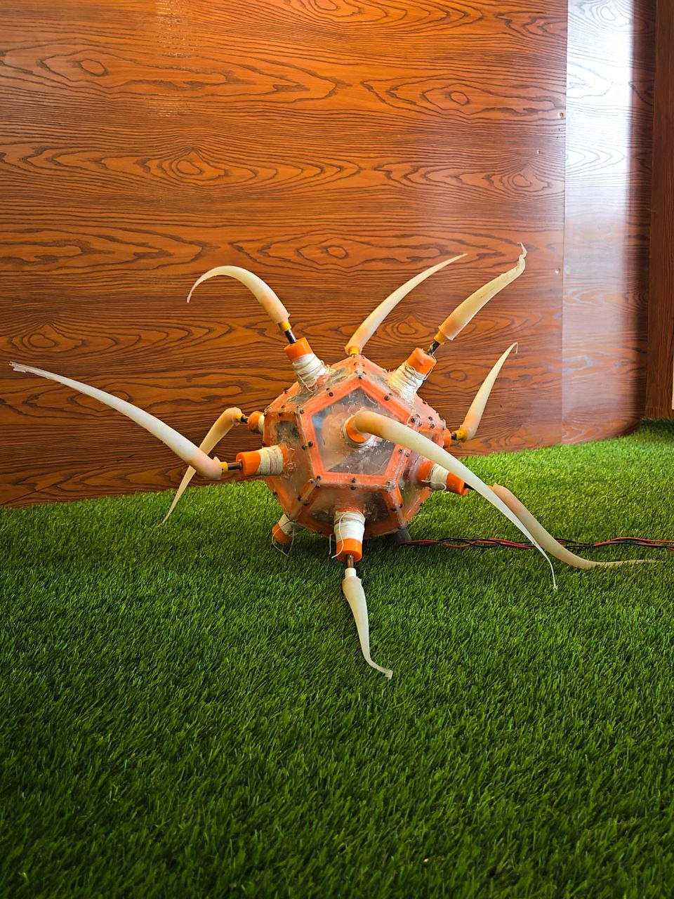
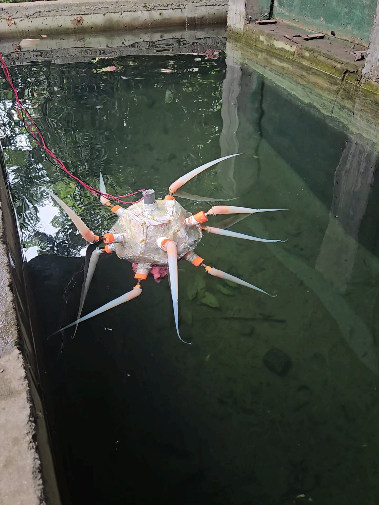
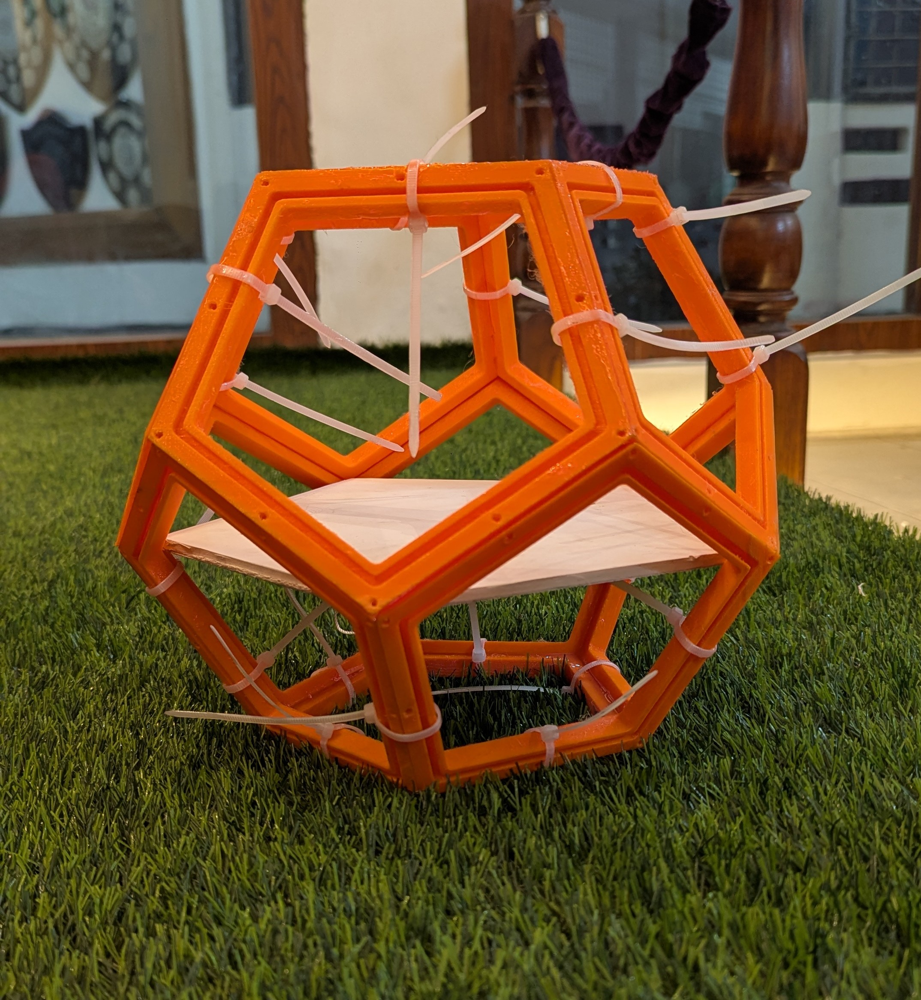
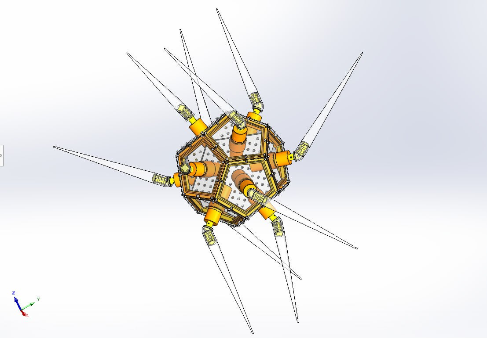

# BactoBot: A Low-Cost, Bacteria-Inspired Soft Underwater Robot

BactoBot is a low-cost, soft underwater robot designed for safe and gentle marine exploration. It is inspired by the highly efficient flagellar propulsion of bacteria and built with accessible, DIY-friendly methods. This project was developed for the ME366: Electro-Mechanical System Design and Practice course at Bangladesh University of Engineering & Technology (BUET).

**[Watch the BactoBot in Action on YouTube](https://youtube.com/playlist?list=PLP1MpXDFlhkGGiaM0PEvsT2b7slWMGMUH&si=1uSfNwjm8kVEyjde)**

---

## Concept and Inspiration

Traditional rigid ROVs, with their high-speed propellers, pose a significant risk to delicate ecosystems like coral reefs. This project draws its primary inspiration from the **ZodiAq** robot, a groundbreaking design from Khalifa University, which demonstrated the potential of using multiple flexible, bacteria-like flagella for underwater locomotion.

BactoBot serves as an accessible, open-source implementation of this concept. By leveraging 3D printing, silicone molding, and common hobbyist electronics, it aims to provide a functional proof-of-concept for a safer, more compliant class of underwater drones.

*   **Primary Reference:** Mathew, A. T., et al. (2025). "ZodiAq: An Isotropic Flagella-Inspired Soft Underwater Drone for Safe Marine Exploration." *Soft Robotics*.
*   **DOI:** [10.1089/soro.2024.0036](https://doi.org/10.1089/soro.2024.0036)
*   **Preprint:** [arXiv:2403.19556](https://arxiv.org/abs/2403.19556)

## Table of Contents
- [Key Features](#key-features)
- [System Architecture](#system-architecture)
  - [Mechanical Design](#mechanical-design)
  - [Electrical System](#electrical-system)
- [Bill of Materials (BOM)](#bill-of-materials-bom)
- [Build Instructions](#build-instructions)
- [Future Work & Research Directions](#future-work--research-directions)
- [Contributors](#contributors)
- [Supervisors & Acknowledgements](#supervisors--acknowledgements)
- [License](#license)

## Key Features
- **Soft, Flexible Actuators:** 12 silicone-molded flagella that passively deform into a propulsive helical shape when rotated.
- **Redundant & Robust Design:** A 12-faced dodecahedron frame provides inherent redundancy; the robot can maintain mobility even with the failure of one or more arms.
- **Low-Cost & Replicable:** Built with readily available components and 3D-printed parts, making the design accessible to other researchers and hobbyists.
- **Inherently Safe:** The propeller-less design and soft arms minimize the risk of damaging fragile marine life during exploration.

## System Architecture

### Mechanical Design
The core structure is a **dodecahedron frame** assembled from 12 3D-printed PETG faces, providing symmetric mounting points for the actuators. The 12 propulsive **flagella** were molded from food-grade silicone rubber for high flexibility and safety. Each flagellum is coupled to a motor shaft via a rigid, 3D-printed hook embedded during casting.

- **CAD Files:** All design files, in both native SolidWorks (`.SLDPRT`) and universal STEP (`.step`) formats, are available in the `/CAD` directory.

### Electrical System
The system is controlled by an **Arduino Mega 2560**. To accommodate significant space constraints within the dodecahedron frame, the 12 motors are driven in opposing pairs. Each pair is wired in parallel and controlled by a single **BTS7960 High-Current H-Bridge**, for a total of 6 driver modules.

This parallel configuration is highly effective for the primary maneuvers of forward motion, reverse, and turning. The primary trade-off for this space-saving design is the loss of individual control over each of the 12 flagella.

A buck converter steps down the main battery voltage to provide stable 5V power to the Arduino via its `VIN` pin.

## Bill of Materials (BOM)
The total estimated cost at the time of construction was approximately **43,359 BDT (~$370 USD)**.

<b>Click to expand the full Bill of Materials</b>

### Electrical Components
| Component                  | Quantity | Notes                                                     |
| -------------------------- | -------- | --------------------------------------------------------- |
| Arduino Mega 2560 R3       | 1        | Central microcontroller.                                  |
| BTS7960 Motor Driver Module| 6        | High-current H-bridge. See Electrical System section for wiring. |
| DC Geared Motor            | 12       | 12V, 100RPM, 25GA High Torque.                            |
| 3S LiPo Battery            | 1        | 3300mAh with XT60 connector recommended.                  |
| Jumper Wires & Hookup Wire | 1 Set    | Assorted lengths and gauges for signal and power.         |

### Structural & Mechanical Components
| Component                  | Quantity | Notes                                                     |
| -------------------------- | -------- | --------------------------------------------------------- |
| Silicone Rubber            | ~1.75 kg | For molding the 12 flexible flagella.                     |
| 3D Printed Parts           | 1 Set    | PETG filament. Includes frame, motor canisters, hooks, and molds. |
| Laser Cut Faceplates       | 12       | Acrylic or similar waterproof material.                   |
| Motor Shafts               | 12       | Mild Steel.                                               |
| Fasteners                  | 1 Set    | Assorted M3 screws, cord screws, nuts, and bolts.         |
| Adhesives                  | 1 Set    | Epoxy and B7000 for permanent assembly.                   |

### Waterproofing & Buoyancy Components
| Component                  | Quantity | Notes                                                     |
| -------------------------- | -------- | --------------------------------------------------------- |
| O-Rings                    | ~31      | 16 Small, 15 Large for sealing motor shafts and faceplates. |
| Sealants & Lubricants      | 1 Set    | Silicone sealant, grease, and light machine oil.          |
| Tapes & Consumables        | 1 Set    | Thread seal tape, electrical tape, foam, etc.             |
| Ballast Weights            | ~5 kg    | Lead or steel weights for achieving neutral buoyancy.     |

## Build Instructions
This guide outlines the fabrication and assembly of the BactoBot prototype.

### 1. Component Fabrication
-   **3D Printing:** Using the files in `/CAD`, print all structural components(frames, motor cannister assmeblies, flagellar hooks). **PETG** is recommended.
-   **Silicone Molding:** Cast **12 flexible flagella** using the 3D-printed molds. Remember to embed a rigid `Hook` at the base of each arm before the silicone cures.
-   **Laser Cutting:** Cut **12 hexagonal faceplates** from 3mm acrylic sheet. Include 2 racks to hold the electronics inside the structure.

### 2. Mechanical & Electrical Assembly
-   **Frame Construction:** Assemble the 12 printed faces into a **dodecahedron** using strong epoxy.
-   **Motor Installation:** Mount the 12 DC motors inside their dedicated canisters.
-   **Wiring:** Install the Arduino, motor drivers, and all wiring according to the provided **schematic**. Ensure all connections are secure before sealing.

### 3. Waterproofing
This step is critical and requires meticulous attention to detail.
-   Follow the **multi-layer sealing protocol** detailed in the `/Documentation` folder.
-   Key steps include creating the dynamic **O-ring and grease seals** for the 12 rotating shafts and sealing all faceplates with silicone.
-   **Perform incremental leak tests** in shallow water before fully submerging the robot.

### 4. Software and Calibration
-   **Firmware Upload:** Upload the Arduino sketch from `/Code` to the microcontroller.
-   **Buoyancy Calibration:** In a test tank, add internal ballast weights incrementally until the robot achieves stable **neutral buoyancy**.

## Future Work & Research Directions
The current prototype successfully validates the core mechanical design and propulsion concept using a simple, open-loop control script. This provides a solid foundation for significant advancements, primarily in software, control systems, and autonomy. The following is a proposed roadmap for transforming BactoBot from a proof-of-concept into a capable research platform.

### 1. Advanced Software Architecture & Control
-   **Develop a Modular Control Library:** Refactor the current hardcoded Arduino script into a clean, function-based library. Create functions like `moveForward(speed)`, `turn(direction, speed)`, and `setFlagellaState(motor_index, state)`, which will make the code more readable, scalable, and easier to build upon.
-   **Implement a State Machine:** Transition from a simple time-based loop to a robust state machine (e.g., `IDLE`, `MOVING_FORWARD`, `TURNING`, `STATION_KEEPING`). This is essential for managing complex tasks and behaviors.

### 2. Real-Time Teleoperation
-   **Integrate Wireless Communication:** Add a wireless communication module (like Bluetooth or Wi-Fi) to enable real-time remote control.
-   **Develop a Ground Control Station:** Create a simple computer- or phone-based interface to send commands to the robot, view status data, and manually control its movement.

### 3. Closed-Loop Control & Stabilization
-   **Integrate an Inertial Measurement Unit (IMU):** This is the most critical hardware upgrade. An IMU (like the MPU-6050) provides real-time orientation feedback (roll, pitch, yaw).
-   **Develop a PID Control System:** Use the IMU data to implement a PID (Proportional-Integral-Derivative) controller to maintain a heading, perform precise turns, and achieve station-keeping.

### 4. Environmental Perception & Autonomy
-   **Add a Sensor Suite:** Enhance the robot with exteroceptive sensors like waterproof cameras for visual feedback, sonar for obstacle detection, and a depth sensor to maintain specific depths.
-   **Develop Autonomous Navigation Algorithms:** With a full sensor suite, research can then focus on implementing foundational robotics algorithms like obstacle avoidance and waypoint navigation.

## Contributors
*   **Ronojoy Roy** (Student ID - 2110142)
*   **Nayan Bala**  (Student ID - 2110158)
*   **Rubaiyat Tasnim Chowdhury**  (Student ID - 2110163)
*   **Tarek Mahmud**  (Student ID - 2110177)

## Supervisors & Acknowledgements
We express our sincere gratitude to our project supervisors for their invaluable guidance:
*   Dr. Kazi Arafat Rahman, Associate Professor, ME, BUET
*   Priom Das, Assistant Professor, ME, BUET
*   Sadia Tasnim, Lecturer, ME, BUET
*   Md. Moyeenul Hossain Ratul, Lecturer, ME, BUET

## License
This project is licensed under the MIT License. See the [LICENSE](LICENSE) file for details.
